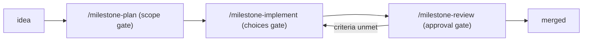

# cairn

*A cairn is built one stone at a time, and marks the trail for whoever
comes next.*

A Claude Code plugin for milestone-driven development. It keeps a
governed LLM Wiki for project state: the agent maintains it, you gate it.
One canonical workflow covers planning, implementation, review, hotfixes,
releases, and expert escalation, with all project state in plain markdown
under `cairn/`, kept in bounds by weight caps and a self-auditing health
check. Rigor scales to stakes: each milestone is classified user-facing or
internal when it's planned, and the criteria audit and the review fan-out
size themselves to that. The core is language-agnostic; each repo declares a
toolchain profile (R, Python, Docker image, or generic) that supplies its
language-specific commands. Work lands as small stacked milestones, and any
session, today's or next month's, can find the path from the files alone.

cairn grew out of maintaining many R packages with Claude Code and rebuilding
similar-but-diverging tracking systems in each. This plugin centralizes the
logic (skills, rules, templates) so every repo works identically; each repo
holds only its own state.

Release history lives in [CHANGELOG.md](CHANGELOG.md); design rationale in
`cairn/DESIGN.md` and the append-only decision log it points to.

## Install

Two paths; pick one. Running both installs the plugin twice, and the
duplicates will confuse skill routing.

**Dev install (recommended):** clone and symlink into your
skills directory. The plugin loads from your checkout, so `git pull`
updates it with no re-install step:

```bash
git clone https://github.com/jmgirard/cairn
ln -s /path/to/cairn ~/.claude/skills/cairn
```

One caution: the symlink is live. Whatever branch the checkout has is what
loads at your next session start, in every repo, enforcement hooks
included. Keep the checkout on `main` unless you're developing cairn
itself. For a one-off trial without installing anything, use
`claude --plugin-dir /path/to/cairn` (that session only).

**Marketplace install:** a frozen snapshot; re-install to pick up new
releases. In Claude Desktop: Customize → Plugins. From the CLI:

```bash
claude plugin marketplace add jmgirard/cairn
claude plugin install cairn@cairn
```

Either way, the install includes the guardrail hooks: the blocking ones
(merge approval, a force-push guard on your default branch), the
housekeeping ones (session-start tracking re-injection, the
uncommitted-tracking stop guard),
and the advisory nudges,
none of which block anything
you're doing. A nudge fires
when an idea gets captured somewhere other than the roadmap, when
something durable is headed for Claude's memory instead of your tracking
files, and when a commit on your default branch reaches outside `cairn/`.
The hooks activate at the next session start and are no-ops in repos that
aren't cairn-tracked.

Then, in your package repo, run `/cairn-init`. Fresh repos get scaffolding;
repos with an older tracking system get an interactive, PR-based migration.
Run `/milestone` any time you're unsure where things stand.

## The core loop

Development is a cycle of milestones: PR-sized units of work with explicit
acceptance criteria. You steer at defined gates; Claude works autonomously
between them:



Each phase ends the same recognizable way: a short recap, a status table,
and the next command in a copyable block — you run it when you're ready.
Decisions along the way (plan questions, merge approval) arrive as
clickable options.

## A worked example

Say your repo is a small CLI tool and you want a `--dry-run` flag.

**1. Plan it.** You say: *"plan a milestone: add a --dry-run flag to the
sync command."* Claude reads the roadmap, decisions, and the relevant code,
then asks one short batch of scoping questions, each with a recommendation.
Should `--dry-run` cover `sync` only or every mutating subcommand? Is
printing the would-be actions enough, or must exit codes match a real run?
You click answers (or type your own). Claude writes
`cairn/milestones/M007-dry-run-flag.md` with the goal, in and out scope,
verifiable acceptance criteria, and ordered tasks, registers it in the
ROADMAP as `planned`, commits, and offers a chip: **Start implementing
M007**.

**2. Build it.** `/milestone-implement M007` cuts a branch, asks any
implementation choices the plan left open (flag naming, output format),
then works the tasks in order: tests first, one checkpoint commit per
task, each commit updating the milestone file's checkboxes alongside the
code. Between the gate and the finish you aren't asked anything. When all
tasks pass, status flips to `review` and you get a diff summary with the
next command ready to copy: `/milestone-review M007`.

**3. Ship it.** `/milestone-review M007` re-runs every check fresh, gathers
evidence for each acceptance criterion (no evidence, no tick), and hands
the diff to independent reviewer agents that didn't write it — a three-lens
fan-out for anything touching executable or user-facing surface, a single
reviewer for an internal docs-only diff. Findings come to you ranked, and
you decide what gets fixed before merge. Then it
opens a PR and asks *you* to merge, with the evidence in front of you.
Nothing lands on your default branch until you say yes. After the merge,
the milestone compresses to a short summary in the archive, the ROADMAP
row flips to `done`, and the next session, tomorrow or next month, resumes
from the files alone.

**Start each phase in a fresh session.** That's the intended mode, not just
a supported one: the milestone file is the handoff, so plan, implement, and
review each start cold from the files. Clearing between phases costs
little — the plan already distilled the investigation — and avoids dragging
a long session into context compaction. Review benefits most: a session
that didn't watch the code get written verifies from evidence instead of
inheriting the implementer's assumptions. The exception is a small
milestone with a short planning phase, where continuing straight into
implementation is fine.

## Which skill, when

| You want to… | Do this |
|---|---|
| See where the project stands / what to do next | `/milestone`: status snapshot, health audit, and a suggested next action |
| Capture an idea for later | Just say it: "add X to the candidates" (one ROADMAP row, no ceremony) |
| Turn an idea into a real plan | `/milestone-plan <title>`: investigation, scoping questions, milestone file(s) with acceptance criteria |
| Build a planned milestone | `/milestone-implement M<NNN>`: branch, tests-first tasks, checkpoint commits; resumable across sessions |
| Verify and ship a finished milestone | `/milestone-review M<NNN>`: fresh evidence for every criterion, independent code review sized to what the diff touches, merge on your approval |
| Get a stronger model's judgment on a hard question | `/milestone-brief M<NNN> <topic>`: writes a self-contained brief; you approve (or run) the Fable review. Its report advises by default — it only binds the milestone if you asked it to |
| Fix a reported bug quickly | `/hotfix`, or just describe the bug: regression test, fix, PR, your approval. Escalates to a milestone if it's bigger than it looked |
| Take in an outside pull request | `/hotfix` again: it adopts the contributor's PR (`gh pr checkout`), holds it to the same bar, and merges on your approval |
| Fix a typo or tweak docs | Just ask: trivial edits commit directly to main, no tracking |
| Prune the backlog | `/cairn-triage`: one proposal per candidate row and known issue, one gate, one docs-only commit on your say-so |
| Prepare a release | `/cairn-release`: follows your repo's profile (a CRAN walk, a registry walk, or a version bump and tag); you run the final submit or tag step yourself |
| Articulate a repo's design & principles | `/design-interview`: a two-phase interview (facts, then principles) that fills `DESIGN.md`; best run on Fable |
| Adopt the system in another repo | `/cairn-init`: idempotent; safe to re-run |

## What lives where

```
your-package/
├── CLAUDE.md                  # lean router; never holds status
└── cairn/
    ├── DESIGN.md              # architecture as it IS + principles
    ├── ROADMAP.md             # milestone index — the only status authority
    ├── DECISIONS.md           # append-only decision log
    ├── LESSONS.md             # durable repo lessons, capped and pruned
    ├── milestones/            # one file per milestone (+ archive/)
    ├── reviews/               # Fable review briefs & reports (+ archive/)
    └── references/            # source + synthesis notes; sources/ gitignored
```

Boundary rule:
**Architecture → DESIGN · Status → ROADMAP · Tasks → milestone files · Decisions → DECISIONS · Lessons → LESSONS · History → archive + git log.**

## Keeping track of sources

When something in your repo rests on knowledge from outside it (a formula
from a paper, a cutoff from a standard, another tool's documented behavior),
cairn asks you to write that source down as a page under `cairn/references/`.
Statistical work is the obvious case, but any repo that takes a fact from
somewhere else accumulates these.

- **A page is owed when you start relying on the source.** Reading something
  in passing owes nothing. Once a value, convention, or decision in the repo
  traces back to it, the page gets written in the same piece of work that
  takes the dependency.
- **A page says where it came from and whether anyone has checked it.** Each
  one records the source it came from, when it was read, and
  whether its extracted values have actually been re-read
  against the original, or are still a first pass nobody has confirmed. That
  record exists because an unchecked extraction is easy to mistake for a
  confirmed one.
- **Facts about the source outlive notes about your repo.** "Table 3 gives
  0.75" stays true as long as the paper does. "We haven't pulled that one
  yet" can stop being true the same day. The second kind gets stamped with the date
  it was written, so a later reader doesn't inherit it as permanent.
- **The health check tells you when a page has gone stale.** `/milestone`
  warns about pages never checked against their source, pages last checked
  over six months ago, and pages whose own status is too vague to tell,
  including ones only partly verified.
  These are warnings, never gate failures:
  whether the evidence is good enough is your call; no script can settle it.

Two templates ship for authoring these, one per page type; `/cairn-init` puts
the directory in place and the shelf of original files stays out of git.

## When your repo produces numbers

If nothing in your repo computes a result — a statistic, a score, a fitted
value — skip this; the rules below never load. Where it does, cairn checks the
number against ground truth rather than against the code that produced it. A
test that pins today's output is a regression guard, not evidence the number
is right.

- **Two independent kinds of check, not two copies of one.** Every result is
  backed by at least two of: a published formula recomputed with deliberately
  plain code, an independent implementation run at test time, two internal
  routes that must agree, a reference value committed with the generator that
  made it, or data simulated from known parameters the estimator has to
  recover. Two of the same kind doesn't count.
- **An interval's check is coverage.** For a confidence interval, the test is
  that it covers the known value at its nominal rate across simulated samples,
  not that its endpoints match a saved pair of numbers.
- **What backs each number is written down.** Each check is recorded with its
  kind, the test asserting it, and where it came from, so the two-kinds bar can
  be audited later. The shape of that record is yours to pick.

These rules are the same in every language; they are not part of a toolchain
profile.

## What the system expects from you

- **Answer the gates.** Questions arrive in small batches at three points
  (planning scope, implementation choices, merge approval), each with a
  recommendation. Between gates, expect autonomy. Questions arriving
  mid-implementation are a sign something has gone wrong.
- **Boundaries are stops, not automation.** A phase ends with a copyable
  next command that nothing runs but you, and a decision's clickable
  options wait until you pick one; walking away at either point is always
  safe, and the last checkpoint commit holds the state for next time.
- **Merges are yours.** Nothing reaches your default branch without your
  explicit approval at review. A guard hook mechanically blocks merges
  that lack a recorded approval, and the approval names the one PR it
  covers. Starting a review is not merging; you get the evidence first.
  (The guard watches what Claude runs, not what you do; see *Working with
  collaborators*.)
- **Supply primary sources.** If a formula, cutoff, or scoring key needs a
  paper the model can't access, it will stop and ask you for the PDF rather
  than work from memory. Feed it the PDF.
- **Fable uses more tokens.** Fable is no longer pay-on-demand, but a Fable
  review typically uses more tokens than Opus, so each one asks your approval
  with a scope estimate first. Declining is fine; the brief file remains
  and can be run any time.
- **Run `/milestone` when returning after time away.** It reconciles
  tracking against git, flags stale work, and hands you the resume command.

## Habits that keep it healthy

- One milestone in progress at a time. Before starting a second, finish or
  explicitly pause the first.
- Let milestones be small. The plan skill will propose splitting oversized
  ones; take the split. Three small merges beat one sprawling branch.
- Don't hand-maintain status in chat or memory: if it isn't in `cairn/`
  files or git, it didn't happen. Hand-editing the files is fine;
  ROADMAP.md wins any conflict.
- Trust the archive. Done milestones compress to short summaries; the full
  story stays in git history and the PR.

## Working with collaborators

cairn is built for **one person running these skills**, with contributions
arriving from people who don't. That works fine, as long as you are clear
about where the guardrails actually reach.

- **The guards only watch this session.** Every protection is a hook on the
  commands Claude runs for you. If you merge a PR in the GitHub web UI, or a
  merge queue does it, or a collaborator merges from their own machine
  without the plugin, cairn sees none of it: the merge-approval requirement
  and the never-force-push rule become promises rather than blocks, and the
  post-merge bookkeeping happens late or not at all. Nothing breaks; you
  just lose the mechanical enforcement. Run `/milestone` afterwards to reconcile.
- **Everything else was always a promise.** Evidence before ticking a
  criterion, tracking updates riding along with code, the review fan-out:
  those are conduct rules Claude follows, not things a hook enforces. They
  hold as long as the work goes through the skills.
- **Contributions come in through you.** An outside PR or issue is an inbox
  item, not a second tracking system: you triage it into a candidate row, a
  hotfix, or a milestone, and your session's guards govern the merge. The
  contributor needs no plugin, no `cairn/` knowledge, and no special branch
  name. `/milestone`'s health audit enumerates both inboxes and proposes a
  disposition per item; an adopted PR comes in through `/hotfix`.
  The audit also lists pull requests merged by others since the last
  hygiene stamp — it only reads, writing nothing to GitHub — and each one
  becomes a triage item. `/milestone-plan`'s collision check also reads
  both open inboxes and offers a disposition only for an item overlapping
  the scope being planned.
- **Issues a milestone resolves get linked and closed.** When a plan absorbs
  a GitHub issue, the milestone file's `Resolves:` slot names it and the
  plan gate offers one option to post `Queued as M<NNN>: <title>` on each
  slotted issue — posted only if you select it, never by default. The
  review's draft PR body ends with `Closes #N` (or `Refs #N` for an issue
  only partly resolved), so GitHub closes the issue at merge. After the
  merge the review reads the state of each issue slotted `closes` and closes
  one still open with a comment naming the merged PR; `/milestone`'s audit
  reports an issue still open after its milestone is done (among the
  roadmap's retained done rows) and offers to close it at the triage chip.
  Without `gh`, the post-merge check and the audit name the gap and carry on.
- **Two people both running cairn is not supported yet.** The tracking files
  would race: milestone IDs and decision numbers are picked by reading the
  files, so two people planning at once can pick the same one. If you need
  this, say so; it's a tracked candidate, not a solved problem.

## What this system deliberately does NOT do

- Auto-merge, auto-release, or auto-submit to CRAN: every irreversible step
  is gated on you.
- Propose, plan, or nominate a release. cairn will prepare one when you ask
  and never brings it up on its own: no ready-to-ship suggestions, and
  no release work queued into the roadmap unprompted. A release is ready
  when you say it is, not when a dependency list is finished, so
  release timing is yours to declare
  and cairn stays quiet about it until you do.
- Track status in CLAUDE.md, chat memory, or GitHub issues: `cairn/`
  files are the single source of truth; issues are an inbox.
- Run Fable, or any escalation, without a per-instance yes.
- Lock you in. Pausing costs nothing (stop any time; checkpoint commits
  keep the branch resumable), dropping a milestone is one sentence, like
  "drop M007", with the reason archived, and uninstalling is removing the
  plugin or symlink: your `cairn/` files are plain markdown that stay
  readable, and deletable, without it.
