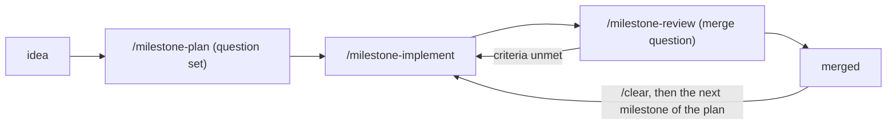

# cairn

*A cairn is built one stone at a time, and marks the trail for whoever
comes next.*

A Claude Code plugin for milestone-driven development. It keeps a
governed LLM Wiki for project state: the agent maintains it, you gate it.
One canonical workflow covers planning, implementation, review, hotfixes,
releases, and expert escalation, with all project state in plain markdown
under `cairn/`, kept in bounds by weight caps and a self-auditing health
check. Rigor scales to stakes: each milestone is classified user-facing or
internal when it's planned, and the criteria audit and the review fan-out
size themselves to that. The core is language-agnostic; each repo declares a
toolchain profile (R, Python, Claude Code plugin, Docker image, or generic)
that supplies its language-specific commands. Work lands as small stacked
milestones, and any session, today's or next month's, can find the path from
the files alone.

cairn grew out of maintaining many R packages with Claude Code and rebuilding
similar-but-diverging tracking systems in each. This plugin centralizes the
logic (skills, rules, templates) so every repo works identically; each repo
holds only its own state.

Release history lives in [CHANGELOG.md](CHANGELOG.md); design rationale in
`cairn/DESIGN.md` and the append-only decision log it points to.

## Install

Two paths; pick one. Running both installs the plugin twice, and the
duplicates will confuse skill routing.

**Dev install (recommended):** clone and symlink into your
skills directory. The plugin loads from your checkout, so `git pull`
updates it with no re-install step:

```bash
git clone https://github.com/jmgirard/cairn
ln -s /path/to/cairn ~/.claude/skills/cairn
```

One caution: the symlink is live. Whatever branch the checkout has is what
loads at your next session start, in every repo, enforcement hooks
included. Keep the checkout on `main` unless you're developing cairn
itself. For a one-off trial without installing anything, use
`claude --plugin-dir /path/to/cairn` (that session only).

**Marketplace install:** a frozen snapshot; re-install to pick up new
releases. In Claude Desktop: Customize → Plugins. From the CLI:

```bash
claude plugin marketplace add jmgirard/cairn
claude plugin install cairn@cairn
```

Either way, the install includes the guardrail hooks: the blocking ones
(merge approval, a force-push guard on your default branch), the
housekeeping ones (session-start tracking re-injection, the
uncommitted-tracking stop guard),
and the advisory nudges,
none of which block anything
you're doing. A nudge fires
when an idea gets captured somewhere other than the roadmap, when
something durable is headed for Claude's memory instead of your tracking
files, and when a commit on your default branch reaches outside `cairn/`.
The hooks activate at the next session start and are no-ops in repos that
aren't cairn-tracked.

Then, in your package repo, run `/cairn-init`. Fresh repos get scaffolding;
repos with an older tracking system get an interactive, PR-based migration.
Run `/milestone` any time you're unsure where things stand.

### The milestone band

The plugin also ships a Claude Code mod: a band above the prompt that shows
one row for the milestone in flight, or between milestones for the next one
you can start. The milestone in flight is the first `in-progress` row of
`cairn/ROADMAP.md`, else its first `review` row. While `/milestone-review`
runs, it is the first `review` row when one exists. The row gives no sign
of the other active milestones. The id in bold and the milestone's title
sit at the left of the row. The flow track and the percent sit at its
right edge. One of the band's test fixtures gives this row when M010 is
its only active milestone, shown here with the track as `[track]`:

```text
M010 Nested tasks and a capital X  [track] 88%
```

The track is one rounded bar of three equal parts: plan, implement, then
review. On a milestone row, plan is full. Implement fills by the checked
boxes of `## Tasks`, and it is full on a `review` row. Review fills by the
checked boxes of `## Acceptance criteria`. Specks fill the track from its
left end to the edge of the current phase's fill. They start sparse and
gray, and they grow dense near the edge, where more of them take the
phase's color: `rgb(110,140,190)` blue for plan, `rgb(194,122,92)` orange
for implement, and `rgb(106,165,122)` green for review. These colors are
fixed and do not follow your theme. A pill on that edge names the phase
and its counts, such as `Implement 1/3` or `Review 1/2`, in the phase's
color. A section with no boxes shows `no tasks` or `no criteria` in the
pill. The percent of the whole flow follows the track. Each part counts
for a third, and the percent rounds down. So it reads 100% only on a
`review` row whose criteria are all checked, and a `review` row with no
criteria reads 66%.

In the desktop app, and on any other surface that can draw an image, the
track is an image. Two thin marks divide the three
parts. In the current part, a tick marks each item edge past the fill when
the items are 6 pixels apart or more. The image cannot follow your theme's
colors, so it draws in translucent grays meant for a light or a dark
background. In the terminal the track is a run of braille characters on
your theme's `userMessageBackground` color. Its dots are the specks, a dim
mark divides the parts past the fill, and the pill is white text on the
phase's color.

The desktop app draws the track at 7 pixels a column, up to 52 columns and
at most 360 pixels. The terminal draws it at most 52 characters wide. In a narrower window the track gets shorter, so that the
title keeps 10 columns, or its full width when the title is shorter. The
track keeps at least 12 columns. When the whole pill would take more than
a third of the track, the pill shows the counts alone, such as `1/3`, or
`none` for a section with no boxes. The band counts one column per
character, so a short title of wide characters, such as CJK characters or
emoji, can get less room than it draws. A title too long for the width is
cut at its end, and the right part stays at the right edge.

A row whose `File/Archive` path names no regular file the band can read
shows `no milestone file` in place of the track, or `no file` in a narrow
window, in your theme's warning color. The rest of the row draws in the
theme's gray. If another plugin draws a band in the same place, its rows
show under cairn's.

The band draws nothing of the running cairn skill. It keeps track of the
skill for two things: the row it shows during `/milestone-review`, and
when a hidden band shows again (below). A cairn skill counts from its
start, by its plain name or its `cairn:` name. It stays until Claude stops
with no background work in flight, such as after the skill's closing
summary. A question chip the skill asks you waits
inside the turn, so the skill stays while you answer it. A question asked
in plain text ends the turn. With no background work in flight, the skill
ends with it, and otherwise your typed answer ends it. When Claude ends a turn
to wait for background work, such as the reviewers that
`/milestone-review` starts, the skill stays through the wait and through
the turns that the work's notices start. A prompt you type while Claude is
idle ends the skill. A prompt you type while Claude works keeps it, and so
does a message from another session. An interrupt with Esc keeps it too,
because an interrupted turn has no stop, so the skill stays until your
next prompt or until Claude next stops with no background work in flight.
A cairn skill that starts again, the
same one included, or a session end, a `/clear` included, also ends it.
A subagent that loads a cairn skill also counts, because the skill event
does not say which agent loaded it.

The rule has three limits. A skill that waits through `ScheduleWakeup` or
a scheduled task, and not through background work, ends when Claude
stops. Background work that the skill did not start, such as a server or
a monitor started earlier, keeps a finished skill until your next prompt,
because the band does not tell the skill's own work from other work. A
prompt you type that a hook blocks or drops still ends the skill.

With no milestone active, the band shows an idle row for the next
milestone you can start, whether or not a cairn skill runs. That milestone
is the first `planned` row whose `Depends on` milestones are all done, by
priority and then by id, the one `cairn_next.py` recommends. A dependency
is done when its row is `done` or its file is in
`cairn/milestones/archive/`. The idle row draws the id in bold and the
title, then a track with plan full and the pill `Planned`, and the command
that starts the milestone at the right edge:

```text
M021 Waiting to start  [track] /milestone-implement M021
```

In a narrow window the idle row drops its track, and then its command, so
that the title keeps room. With no workable planned milestone, the band
draws nothing.

The row ends in a close button: `×` in the terminal, and in the desktop
app a `✕` that is dim at rest. On a row drawn from a ROADMAP, a `≡`
button before it opens the cairn pane (below). Pressing the close button
hides the band. Until the session ends, the band stays hidden while the
list of active milestones stays the same: their ids, their statuses, and
their ROADMAP order. For example, a milestone that moves from `implement`
to `review`, or a milestone that becomes active or leaves both statuses,
shows the band again. A cairn skill that starts or ends keeps it hidden,
unless `/milestone-review` moves the band to another row, a `review` row
when an `in-progress` row would show without it. A hidden idle row shows
again when another milestone takes its place. A checked box or an edited title does not bring the band back. A
session end shows a hidden band again, whatever its reason. In the desktop
app, a `/clear` stops the session, and the band draws again at your next
message. If the band finds the ROADMAP but cannot read it, the band keeps
its row. The failed read alone does not hide or show it.

The band finds the ROADMAP in the session's working directory or the nearest
directory above it. It reads the files when the session starts and at the
end of each turn. It also reads them when a cairn skill starts or ends,
and after Claude edits or writes a file under a `cairn/` directory, so a
box Claude checks moves the track inside a long turn. A box you check or a
status you change shows after the next of these.
Outside a cairn repo, it draws nothing. It also gives way while Claude Code shows a survey there. The band draws on
the terminal and in the desktop app.

### The cairn pane

The `/cairn-pane` command opens a pane that shows more than the band. Run
it again to close the pane, or use the pane's own close mark. The band's
`≡` button also opens it. In the desktop app the pane docks beside the
conversation. In the terminal it docks beside a fullscreen conversation
of 110 columns or more, and otherwise it sits above the prompt.

For each `in-progress` or `review` milestone, the pane shows the phase,
id, and title, with the band's percent for the milestone at the end of
that line when its file reads, and the goal from the milestone file. It lists every task
and acceptance criterion, `✓` for a checked box and `○` for an open one,
and the five newest work-log lines. Each item takes one line, a long item
ends in `…`, and the goal wraps. Each section starts after a blank row
with a `▎` and its name in gray capitals. The `TASKS` and `CRITERIA`
headings show their count and eight squares, `■` for the checked share
and `□` for the rest. The next command sits in a pill. The `▎` and `■`
marks of a milestone draw in its phase's color, orange for implement and
green for review. The `▎` marks of the queue draw in the plan blue, and
the pill draws in the color of the phase that its command runs. The
percent counts boxes as the band does, so a box inside an HTML
comment counts there but not in the `TASKS` and `CRITERIA` counts, and
the two can differ. A missing or unreadable
milestone file shows `no milestone file`. Below the milestones, the pane
shows the next command, the workable planned milestones, and the planned
milestones that wait on others, as `scripts/cairn_next.py` gives them.
When no milestone is `in-progress` or `review`, the pane also lists the
ROADMAP's candidate rows under a `CANDIDATES` heading with their count.
Each row takes one line: `↑` for a `[high]` row, `·` for a normal one, and
`↓` for a `[low]` one, then the row's text up to its first `: `. Rows
inside an HTML comment, such as the placeholders of a new ROADMAP, are not
listed.
The pane reads the files at the same moments as the band. Outside a cairn
repo, with no pane open, the command opens no pane and prints `no cairn
ROADMAP found`. A pane that is already open says the same, and the command
closes it.

Mods are on by default from Claude Code 2.1.287
([Getting started with Claude Code mods](https://claude.dev/blog/getting-started-with-claude-code-mods/)),
so that is the version the band needs with no setup. An earlier version
loads the band only where hooks modules are turned on.
On an older Claude Code the rest of the plugin still works. In a headless
(`claude -p`) run of 2.1.284, the merge guard denied a merge and the
session-start tracking context arrived. The band did not load, and the run
printed one line that said hooks modules were not turned on in that process.
That line names the early-access switch, `CLAUDE_CODE_ENABLE_FUNCTION_HOOKS=1`
in the environment.

## The core loop

Development is a cycle of milestones: PR-sized units of work with explicit
acceptance criteria. One command starts a run. You answer one question set
when the plan is made, and Claude then implements and reviews the milestone
in the same run and stops at the merge question:


```mermaid
flowchart LR
    idea["idea"] --> plan["/milestone-plan (question set)"]
    plan --> implement["/milestone-implement"]
    implement --> review["/milestone-review (merge question)"]
    review --> merged["merged"]
    review -->|criteria unmet| implement
    merged -->|/clear, then the next milestone of the plan| implement
```

Each skill starts the next one itself, up to the merge. A merge ends the run.
The closing message gives `/clear` and the command that starts the next
milestone of the same plan, so each milestone starts in a fresh context. Between the two
questions Claude stops only for a short list of reasons: it needs your eyes
or hands, an action the question set did not cover, a goal found wrong,
repeated review failures, a CI wait that times out, and a few others that
the rulebook lists. A run ends the same recognizable way: a short recap, a
status table, and the next command in a copyable block. If a run stopped,
typing `/milestone-implement` or `/milestone-review` with the milestone id
resumes it. A stop that finds the goal wrong names `/milestone-plan`
instead, and the close block always names the command to type.

## A worked example

Say your repo is a small CLI tool and you want a `--dry-run` flag.

**1. Plan it.** You say: *"plan a milestone: add a --dry-run flag to the
sync command."* Claude reads the roadmap, decisions, and the relevant code,
then asks one short batch of questions, each with a recommendation. It asks
only what you alone can settle. Should `--dry-run` cover `sync` only or
every mutating subcommand? Is printing the would-be actions enough, or must
exit codes match a real run? You click answers (or type your own). Claude
writes `cairn/milestones/M007-dry-run-flag.md` with the goal, in and out
scope, verifiable acceptance criteria, and ordered tasks, registers it in
the ROADMAP as `planned`, commits, and starts implementing.

**2. Build it.** Implement cuts a branch and decides the details the plan
left open, such as flag naming and output format, with a log line for each.
It works the tasks in order: tests first, one checkpoint commit per task,
each commit updating the milestone file's checkboxes alongside the code. You
are not asked anything unless the run reaches a listed stop, such as an
action the question set did not cover. When all tasks pass, status flips to `review` and
review starts.

**3. Ship it.** Review re-runs every check fresh, gathers evidence for each
acceptance criterion (no evidence, no tick), and hands the diff to
independent reviewer agents that didn't write it — a three-lens fan-out for
anything touching executable or user-facing surface, a single reviewer for
an internal docs-only diff. Claude settles each finding itself: it fixes a
real one inside the milestone's scope, sends a real one outside it to a
ROADMAP candidate row, and rejects a false one with the reason. Then it
asks *you* to merge, with the evidence and each finding's outcome in front
of you, and opens the PR after your yes.
Nothing lands on your default branch until you say yes. After the merge,
the milestone compresses to a short summary in the archive, the ROADMAP
row flips to `done`, and the next session, tomorrow or next month, resumes
from the files alone.

**A run stays in one session, and the files carry it.** Each phase re-reads
the milestone file and gathers its evidence by command, so nothing depends
on what the session remembers. The reviewers are fresh agents that did not
watch the code get written. If the context runs short, Claude stops at a
task boundary with a checkpoint commit, and the typed command resumes the
run in a fresh session. The end of a run is the natural point to `/clear`.

## Which skill, when

| You want to… | Do this |
|---|---|
| See where the project stands / what to do next | `/milestone`: status snapshot, health audit, and a suggested next action |
| Capture an idea for later | Just say it: "add X to the candidates" (one ROADMAP row, no ceremony) |
| Turn an idea into a real plan and run it | `/milestone-plan <title>`: investigation, one question set, milestone file(s) with acceptance criteria, then implement and review in the same run up to the merge question |
| Resume a run at implement | `/milestone-implement M<NNN>`: branch, tests-first tasks, checkpoint commits, then review; resumable across sessions |
| Resume a run at review | `/milestone-review M<NNN>`: fresh evidence for every criterion, independent code review sized to what the diff touches, each finding settled by the agent, merge on your approval |
| Get a stronger model's judgment on a hard question | `/milestone-brief M<NNN> <topic>`: writes a self-contained brief; you approve (or run) the Fable review. Its report advises by default — it only binds the milestone if you asked it to |
| Fix a reported bug quickly | `/hotfix`, or just describe the bug: regression test, fix, PR, your approval. Escalates to a milestone if it's bigger than it looked |
| Take in an outside pull request | `/hotfix` again: it adopts the contributor's PR (`gh pr checkout`), holds it to the same bar, and merges on your approval |
| Fix a typo or tweak docs | Just ask: trivial edits commit directly to main, no tracking |
| Prune the backlog | `/cairn-triage`: one proposal per candidate row and known issue, one gate, one docs-only commit on your say-so |
| Prepare a release | `/cairn-release`: follows your repo's profile (a CRAN walk, a registry walk, or a version bump and tag); you run the final submit or tag step yourself |
| Articulate a repo's design & principles | `/design-interview`: a two-phase interview (facts, then principles) that fills `DESIGN.md`; best run on Fable |
| Adopt the system in another repo | `/cairn-init`: idempotent; safe to re-run |

## What lives where

```
your-package/
├── CLAUDE.md                  # lean router; never holds status
└── cairn/
    ├── DESIGN.md              # architecture as it IS + principles
    ├── ROADMAP.md             # milestone index — the only status authority
    ├── DECISIONS.md           # append-only decision log
    ├── LESSONS.md             # durable repo lessons, capped and pruned
    ├── milestones/            # one file per milestone (+ archive/)
    ├── reviews/               # Fable review briefs & reports (+ archive/)
    └── references/            # source + synthesis notes; sources/ gitignored
```

Boundary rule:
**Architecture → DESIGN · Status → ROADMAP · Tasks → milestone files · Decisions → DECISIONS · Lessons → LESSONS · History → archive + git log.**

## Keeping track of sources

When something in your repo rests on knowledge from outside it (a formula
from a paper, a cutoff from a standard, another tool's documented behavior),
cairn asks you to write that source down as a page under `cairn/references/`.
Statistical work is the obvious case, but any repo that takes a fact from
somewhere else accumulates these.

- **A page is owed when you start relying on the source.** Reading something
  in passing owes nothing. Once a value, convention, or decision in the repo
  traces back to it, the page gets written in the same piece of work that
  takes the dependency.
- **A page says where it came from and whether anyone has checked it.** Each
  one records the source it came from, when it was read, and
  whether its extracted values have actually been re-read
  against the original, or are still a first pass nobody has confirmed. That
  record exists because an unchecked extraction is easy to mistake for a
  confirmed one.
- **Facts about the source outlive notes about your repo.** "Table 3 gives
  0.75" stays true as long as the paper does. "We haven't pulled that one
  yet" can stop being true the same day. The second kind gets stamped with the date
  it was written, so a later reader doesn't inherit it as permanent.
- **The health check tells you when a page has gone stale.** `/milestone`
  warns about pages never checked against their source, pages last checked
  over six months ago, and pages whose own status is too vague to tell,
  including ones only partly verified.
  These are warnings, never gate failures:
  whether the evidence is good enough is your call; no script can settle it.

Two templates ship for authoring these, one per page type; `/cairn-init` puts
the directory in place and the shelf of original files stays out of git.

## When your repo produces numbers

If nothing in your repo computes a result — a statistic, a score, a fitted
value — skip this; the rules below never load. Where it does, cairn checks the
number against ground truth rather than against the code that produced it. A
test that pins today's output is a regression guard, not evidence the number
is right.

- **Two independent kinds of check, not two copies of one.** Every result is
  backed by at least two of: a published formula recomputed with deliberately
  plain code, an independent implementation run at test time, two internal
  routes that must agree, a reference value committed with the generator that
  made it, or data simulated from known parameters the estimator has to
  recover. Two of the same kind doesn't count.
- **An interval's check is coverage.** For a confidence interval, the test is
  that it covers the known value at its nominal rate across simulated samples,
  not that its endpoints match a saved pair of numbers.
- **What backs each number is written down.** Each check is recorded with its
  kind, the test asserting it, and where it came from, so the two-kinds bar can
  be audited later. The shape of that record is yours to pick.

These rules are the same in every language; they are not part of a toolchain
profile.

## What the system expects from you

- **Answer two questions.** One question set comes when the plan is made,
  each question with a recommendation. It also asks ahead for what the run
  will need from you: a file, a login, a live look, or permission for an
  outward action. The merge question comes at the end of review. Between
  them, expect the agent to decide and log the rest.
- **A run stops only for a listed reason.** It stops when it needs your eyes
  or hands, for an action the question set did not cover, when the goal is
  found wrong or a change would drop something you asked for, after repeated
  review failures, at a CI wait that times out, and at a few others the
  rulebook lists. Walking away at a stop is always safe: the last checkpoint
  commit holds the state, and typing `/milestone-implement` or
  `/milestone-review` with the milestone id resumes the run.
- **Merges are yours.** Nothing reaches your default branch without your
  explicit approval at review. A guard hook mechanically blocks merges
  that lack a recorded approval, and the approval names the one PR it
  covers. Starting a review is not merging; you get the evidence first.
  (The guard watches what Claude runs, not what you do; see *Working with
  collaborators*.)
- **Supply primary sources.** If a formula, cutoff, or scoring key needs a
  paper the model can't access, it will stop and ask you for the PDF rather
  than work from memory. Feed it the PDF.
- **Fable uses more tokens.** Fable is no longer pay-on-demand, but a Fable
  review typically uses more tokens than Opus, so each one asks your approval
  with a scope estimate first. Declining is fine; the brief file remains
  and can be run any time.
- **Run `/milestone` when returning after time away.** It reconciles
  tracking against git, flags stale work, and hands you the resume command.

## Habits that keep it healthy

- One milestone in progress at a time. Before starting a second, finish or
  explicitly pause the first.
- Let milestones be small. The plan skill will propose splitting oversized
  ones; take the split. Three small merges beat one sprawling branch.
- Don't hand-maintain status in chat or memory: if it isn't in `cairn/`
  files or git, it didn't happen. Hand-editing the files is fine;
  ROADMAP.md wins any conflict.
- Trust the archive. Done milestones compress to short summaries; the full
  story stays in git history and the PR.

## Working with collaborators

cairn is built for **one person running these skills** in a repo, whether
you own that repo (owner mode, the default) or are contributing to someone
else's (guest mode, below), with contributions arriving from people who
don't. That works fine, as long as you are clear about where the guardrails
actually reach.

- **The guards only watch this session.** Every protection is a hook on the
  commands Claude runs for you. If you merge a PR in the GitHub web UI, or a
  merge queue does it, or a collaborator merges from their own machine
  without the plugin, cairn sees none of it: the merge-approval requirement
  and the never-force-push rule become promises rather than blocks, and the
  post-merge bookkeeping happens late or not at all. Nothing breaks; you
  just lose the mechanical enforcement. Run `/milestone` afterwards to reconcile.
- **Everything else was always a promise.** Evidence before ticking a
  criterion, tracking updates riding along with code, the review fan-out:
  those are conduct rules Claude follows, not things a hook enforces. They
  hold as long as the work goes through the skills.
- **Contributions come in through you.** An outside PR or issue is an inbox
  item, not a second tracking system: you triage it into a candidate row, a
  hotfix, or a milestone, and your session's guards govern the merge. The
  contributor needs no plugin, no `cairn/` knowledge, and no special branch
  name. `/milestone`'s health audit enumerates both inboxes and proposes a
  disposition per item; an adopted PR comes in through `/hotfix`.
  The audit also lists pull requests merged by others since the last
  hygiene stamp — it only reads, writing nothing to GitHub — and each one
  becomes a triage item. `/milestone-plan`'s collision check also reads
  both open inboxes and settles a disposition only for an item overlapping
  the scope being planned.
  The pull request itself is opened only after you approve at the merge
  chip, so a `pull_request`-triggered suite first runs on the head that
  merges. Where a PR already exists — a return from an earlier review, an
  adopted hotfix PR — both approval gates read its conversation — review
  threads and comments, human or bot — before the merge chip, so nothing
  is merged past unread.
- **Issues a milestone resolves get linked and closed.** When a plan absorbs
  a GitHub issue, the milestone file's `Resolves:` slot names it and the
  plan question set offers one option to post `Queued as M<NNN>: <title>` on each
  slotted issue — posted only if you select it, never by default. The
  PR the review opens after your approval has a body ending with
  `Closes #N` (or `Refs #N` for an issue only partly resolved), so GitHub
  closes the issue at merge. After the
  merge the review reads the state of each issue slotted `closes` and closes
  one still open with a comment naming the merged PR; `/milestone`'s audit
  reports an issue still open after its milestone is done (among the
  roadmap's retained done rows) and offers to close it at the triage chip.
  Without `gh`, the post-merge check and the audit name the gap and carry on.
- **Two people both running cairn is not supported yet.** The tracking files
  would race: milestone IDs and decision numbers are picked by reading the
  files, so two people planning at once can pick the same one. If you need
  this, say so; it's a tracked candidate, not a solved problem.

### Contributing to a repo you don't own (guest mode)

When the repo belongs to someone else, you can still run the whole
plan/implement/review loop, with `cairn/` kept to yourself. `/cairn-init`
asks which mode you are in (it reads your permission level on the remote to
recommend one) and writes `# Collaboration mode: guest` into
`cairn/PROFILE.md`. In guest mode:

- **`cairn/` never leaves your clone.** Init lists it in `.git/info/exclude`
  (git's untracked ignore file that is itself never committed), and the
  commit guard refuses a `git commit` it sees that would carry a `cairn/`
  path (it watches the commit commands Claude runs, with the same known
  misses as before, such as `git -C <path> commit`). Nothing else is
  written outside `cairn/`: no CLAUDE.md section (the session hook
  injects the same routing text from the plugin's template instead), no
  `.gitignore` or `.Rbuildignore` entries, no CI edits.
- **Hygiene is written to disk, not committed.** Plan files, checkbox
  ticks, work-log lines, decisions, lessons: all land in `cairn/` in the
  same turn as the code change, and stay there. There are no docs-only
  commits and no pushes to the default branch.
- **The repo sees none of cairn's vocabulary.** Branches are named by their
  slug alone, and commit messages and PR text carry no milestone numbers.
- **No merge by cairn.** Review ends by handing the PR to the maintainers;
  you never merge, and the approval marker is never written.
- **No release walk, no triage pass.** Both stop at session start and say
  why: releasing and roadmap triage commit to a default branch that isn't
  yours.

Because `cairn/` exists only in that clone, a fresh clone starts from
nothing and `git clean -fdx` removes it; back it up if that matters.
Adopting a third party's PR through `/hotfix` is not supported in guest
mode.

## What this system deliberately does NOT do

- Auto-merge, auto-release, or auto-submit to CRAN: every irreversible step
  is gated on you.
- Propose, plan, or nominate a release. cairn will prepare one when you ask
  and never brings it up on its own: no ready-to-ship suggestions, and
  no release work queued into the roadmap unprompted. A release is ready
  when you say it is, not when a dependency list is finished, so
  release timing is yours to declare
  and cairn stays quiet about it until you do.
- Track status in CLAUDE.md, chat memory, or GitHub issues: `cairn/`
  files are the single source of truth; issues are an inbox.
- Run Fable, or any escalation, without a per-instance yes.
- Lock you in. Pausing costs nothing (stop any time; checkpoint commits
  keep the branch resumable), dropping a milestone is one sentence, like
  "drop M007", with the reason archived, and uninstalling is removing the
  plugin or symlink: your `cairn/` files are plain markdown that stay
  readable, and deletable, without it.
